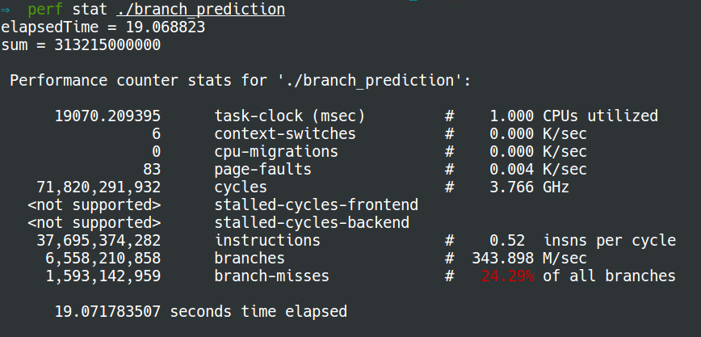
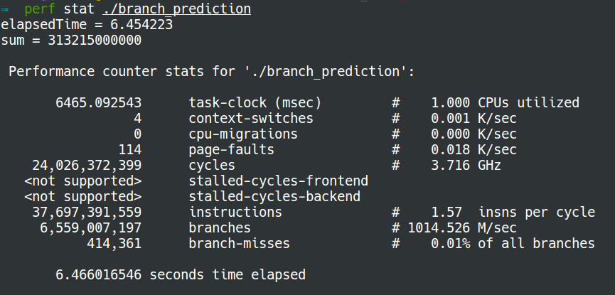
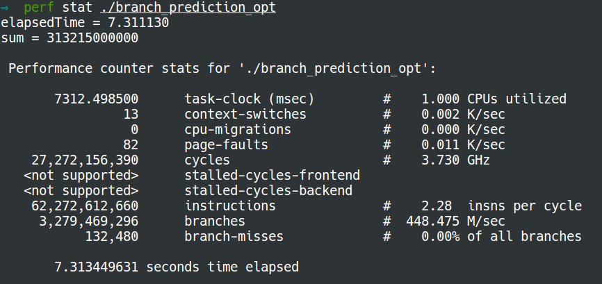

# Sorting and Hack {#branch-prediction}

In this section, we are going to talk about two techniques to improve the branch prediction accuracy, which are sorting and hack. First let us look into the following program to get to know **branch prediction**:

```c
#include <time.h>
#include <stdio.h>
#include <stdlib.h>

int cmpfunc (const void * a, const void * b) {
       return ( *(int*)a - *(int*)b );
}

int main() {
    /* Generate data */
    const unsigned arraySize = 32768;
    int data[arraySize];
    srand((int)123);

    for (unsigned c = 0; c < arraySize; ++c)
        data[c] = rand() % 256;

    /* !!! With this, the next loop runs faster */
    /* qsort(data, arraySize, sizeof(int), cmpfunc); */

    /* Test */
    clock_t start = clock();
    long long sum = 0;

    for (unsigned i = 0; i < 100000; ++i) {
        /* Primary loop */
        for (unsigned c = 0; c < arraySize; ++c) {
            if (data[c] >= 128)
                sum += data[c];
        }
    }
    double elapsedTime = ((double)(clock() - start)) / CLOCKS_PER_SEC;

    printf("elapsedTime = %f\n", elapsedTime);
    printf("sum = %llu\n", sum);
}
```

We use _perf_ to check the number of branch misses:

* **without sorting**

* **with sorting**

**Why sorting makes difference?**

* At the processor level, it considers an if-statement as a branch instruction. The processor sees a branch and has no idea which way it will go. In computers, the processor doesn't know which direction a branch will go until the last moment. So it guesses which direction the branch will go!

  * If it guessed right, continue executing.
  * If it guessed wrong, flush the pipeline and roll back to the branch. Then it can restart down the other path.

* If it guesses right every time, the execution will never have to stop. If it guesses wrong too often, the computer spends a lot of time stalling, rolling back, and restarting. This is branch prediction.

* To minimize the number of wrong guess times, the processor looks at the past history. If "going left" 99% of the time, then it guesses left. If it alternates, then it alternates its guesses. If it goes one way every 3 times, it guesses the same. In other words, it tries to identify a pattern and follow it. This is more or less how branch predictors work.

* Most applications have well-behaved branches. So modern branch predictors will typically achieve &gt;90% hit rates. But when faced with unpredictable branches with no recognizable patterns, branch predictors are virtually useless. This why sorting makes much less branch predictions.

## Hack {#optimization}

If the compiler isn't able to optimize the branch into a conditional move, we can try some hacks which eliminate the branch and replace it with bitwise operations:

```
int t = (data[c] - 128) >> 31;
sum += ~t & data[c];
```

**How this code works?**

* `if data[c] >= 128`, then`t = 0`,`~t & data[c] = data[c]`.
* `if data[c] < 128`, then`t = -1`,`~t & data[c] = 0`.

Therefore, the above two lines can work correctly as same as`if`. Please refer to the references if you would like to know the operators \(`>>`,`~`,`&`\) in detail.

Now the number of branch misses with sorting is almost equal to that without sorting:

* **without sorting:**

* **with sorting:**

**Short circuiting \(Branch prediction with && and &\)**

Both of them can be used to evaluate the correctness of two expressions \(i.e., logical AND\). In the following pseudo code, only both  condition1 and condition2 are true will statement 1 be executed, otherwise statement 2.

```
if (condition1 && (&) condition2) {

    statement 1;
} else {

    statement 2;
}
```

However, there is a difference between them. "&&" serves in the way of "short circuiting", that is an expression will be stopped being evaluated as soon as its outcome is determined. So if condition1 is false, then condition2 will not be executed, unlike "&" which always evaluate the correctness of both conditions. In the case that most of the first condition is false, "&&" shall achieve a better branch prediction accuracy because there is no need to evaluate the correctness of the second condition. This early stop can fasten the program. However, if the first condition is more likely to be true, then it would be better to use "&". The following two programs compare the impact of operators "&&" and "&" on the branch miss rate.

* **operator "&&":**

```c
#include <stdlib.h>
#include <stdio.h>
#include <time.h>

const int n = 100000;

int  filter ( int* A, int* B, int* C, int a, int b, int c)
{
    int i, j = 0;
    for (i = 0; i < n; ++i)
    {
        if(A[i] > a && B[i] > b && C[i] > c)
           j++;
    }

    return j;
}

int main()
{
    srand(time(0));

    int A[100000] = {0};
    int B[100000] = {0};
    int C[100000] = {0};

    for (int i = 0; i < n; ++i)
    {
        int a = rand() /  (RAND_MAX * 1.0) * 10;
        int b = rand() /  (RAND_MAX * 1.0) * 10;
        int c = rand() /  (RAND_MAX * 1.0) * 10;

        A[i] = a;
        B[i] = b;
        C[i] = c;
    }

    int filNum = filter(A, B, C, 2, 2, 2);

    printf("%d\n", filNum);

    return 0;
}
```


* **operator "&":**

The program for this case is simply replacing the condition by

```
A[i] > a & B[i] > b & C[i] > c
```


We can see that the conditions are likely to be true because a randomly generated number is uniformly distributed over the interval 0-10, so the last two conditions need to be evaluated. Therefore, operator "&" can achieve a better branch prediction accuracy than "&&".

**References:**

* [Wikipedia: Branch predictor](https://en.wikipedia.org/wiki/Branch_predictor)
* [Stackoverflow: branch prediction](http://stackoverflow.com/questions/11227809/why-is-it-faster-to-process-a-sorted-array-than-an-unsorted-array)
* [C library function - qsort\(\)](https://www.tutorialspoint.com/c_standard_library/c_function_qsort.htm)
* [C operators](https://www.tutorialspoint.com/cprogramming/c_operators.htm)


