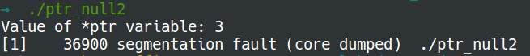

# Null pointer dereference {#null-pointer-dereference}

The following code creates a null pointer, and then tries to read its value. Doing so causes a segmentation fault at runtime.

```c
#include <stdio.h>
int main(void) {
    int *ptr;
    ptr = NULL;
    printf("Value of *ptr variable: %d\n", *ptr); //null pointer dereference
    return 0;
}
```


Dereferencing a null pointer and then assigning a value to it also usually causes a segmentation fault:

```c
#include <stdio.h>

int main(void) {
    int three = 3;
    int *ptr;

    ptr = &three;
    printf("Value of *ptr variable: %d\n", *ptr);

    ptr = NULL;
    *ptr = three; //occur segmentation fault
    /* ptr = &three; //avoid segmentation fault */
    printf("Value of *ptr variable: %d\n", *ptr); //null pointer dereference
    return 0;
}
```



We can avoid the above segmentation fault by storing address of`three`in pointer`ptr`, which means we replace`*ptr = three`with`ptr = &three`.![]


