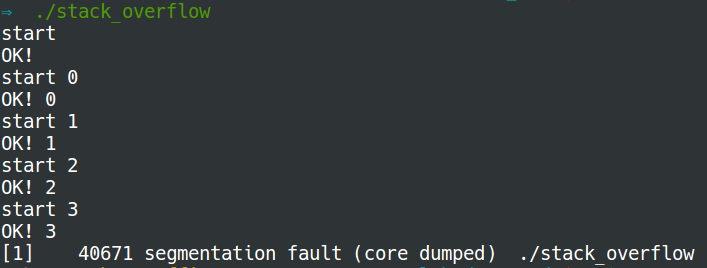

# Stack overflow {#stack-overflow}

A stack overflow results in a segmentation fault. The most common cause of stack overflow is excessively deep or infinite recursion. Now try the code below:


A stack overflow results in a segmentation fault. The most common cause of stack overflow is excessively deep or infinite recursion. Now try the code below:

```c
#include <stdio.h>
#include <string.h>
#include <unistd.h>
void recursion(int i) {
    char a[40 * 1024];
    printf("start %d\n", i);
    memset(a, 0, sizeof(a));
    printf("OK! %d\n", i);
    recursion(i+1);
}
int main(int argc, char **argv) {
    char a[8000 * 1024]; // remaining is 192 * 1024
    printf("start\n");
    memset(a, 0, sizeof(a));
    printf("OK!\n");
    recursion(0);
    return 0;
}

```

Here is the output:



What happened?

* Find out the maximum size of the stack in kilobyte \(KB\)
 
 ```shell
 $ ulimit -s
8192
  ```
* So the maximum size of the stack is **8192 KB**
  = 8192 \* 1024 bytes.
* In the
  `main`
  function, we use 8000 \* 1024 bytes which remains 192 \* 1024 bytes.
* Four calls to the
  `recursion`
  function use 160 \* 1024 bytes.
* So the fifth call to the
  `recursion`
  function exceeds the maximum size of the stack and triggers the stack overflow.


