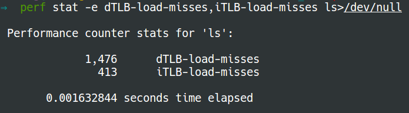

## Use perf to measure cache misses and TLB misses {#use-perf-to-measure-cache-misses-and-tlb-misses}

### Installation {#installation}

Install [_perf_](https://perf.wiki.kernel.org/index.php/Main_Page):

Note that if you use **perf** on department **linux9 **servers, there is no need to install.

```
$ sudo apt-get install linux-tools-common linux-tools-4.4.0-31-generic linux-cloud-tools-4.4.0-31-generic
```

### Usage {#usage}

To measure cache miss:

```
$ perf stat -e cache-misses <command>
```

To collect TLB miss:

```
$ perf stat -e dTLB-load-misses,iTLB-load-misses <command>
```

For example:

```
$ perf stat -e cache-misses ls>/dev/null
```


```
$ perf stat -e dTLB-load-misses,iTLB-load-misses ls>/dev/null
```



