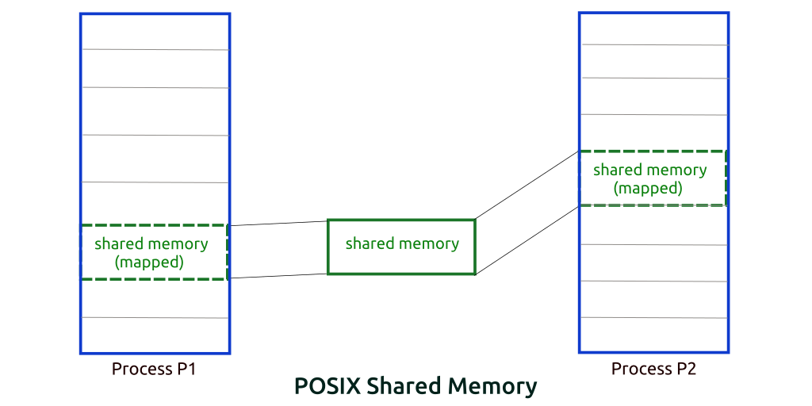

# What is shared memory? {#what-is-shared-memory}

Shared memory is memory that may be simultaneously accessed by multiple programs with an intent to provide communication among them or avoid redundant copies. Shared memory is an efficient means of passing data between programs as shown in figure below.

